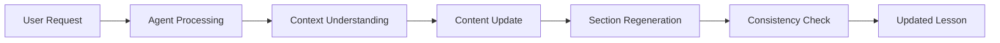
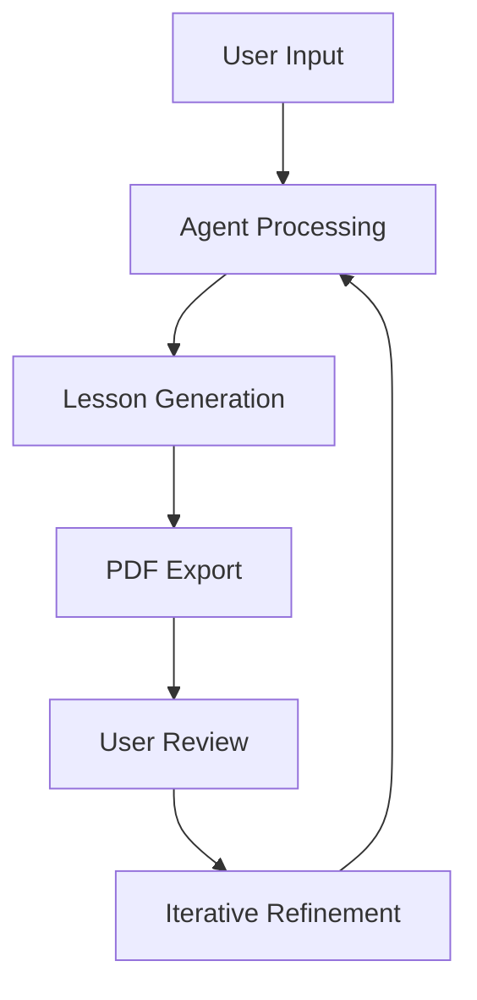

# 🎯 Lessonly MVP (Phase 1) Design

> Comprehensive design specification for the Minimum Viable Product

---

## 📋 Overview

This document outlines the core functionality and design specifications for the Lessonly MVP, focusing on three main modules that deliver a complete lesson generation and customization experience.

---

## ✅ Module 1: Lesson Generation

### 🎯 Purpose
Automatically generate structured English lesson plans using GPT-based agents based on user inputs.

### 📥 Input Parameters

#### **Lesson Theme** (Free Text)
> Examples of acceptable themes:
- 🕷️ **Spider-Man**
- 🌱 **Environmental Protection**
- 🎵 **Billie Eilish's Songs**
- 🇪🇸 **Holidays in Spain**

#### **Grammar/Language Topics** (Multiple Selection)
> Available grammar categories:
- 📚 **Past Perfect**
- 🔧 **Modal Verbs**
- 💬 **Idioms**
- 🔗 **Phrasal Verbs**

#### **Student Level** (Single Selection)
| Level | CEFR Range | Description |
|-------|------------|-------------|
| 🟢 **Beginner** | A1–A2 | Basic vocabulary and simple sentences |
| 🟡 **Intermediate** | B1–B2 | Complex structures and expanded vocabulary |
| 🔴 **Advanced** | C1–C2 | Sophisticated language and nuanced expressions |

### 📤 Output Structure

The generated lesson plan includes the following sections:

1. **📖 Lesson Title & Introduction**
   - Engaging opening
   - Learning objectives
   - Estimated duration

2. **📝 Vocabulary & Key Expressions**
   - Theme-related vocabulary
   - Common phrases
   - Pronunciation guides

3. **🔍 Grammar Focus & Explanations**
   - Clear explanations
   - Practical examples
   - Usage guidelines

4. **🎮 Interactive Activity or Exercise**
   - Discussion questions
   - Role-play scenarios
   - Fill-in-the-blanks exercises
   - Matching activities

5. **📚 Short Reading/Listening Suggestion**
   - Text-based recommendations
   - Simple content suggestions
   - Learning resources

6. **📋 Homework/Assignment**
   - Practice exercises
   - Creative tasks
   - Review materials

---

## ✅ Module 2: PDF Lesson Export

### 🎯 Purpose
Export generated lessons as professionally formatted PDF documents for easy distribution and printing.

### 📄 PDF Structure

| Page | Content | Features |
|------|---------|----------|
| **1** | **Cover Page** | Lesson Title, Level, Theme, Generation Date |
| **2** | **Lesson Overview** | Vocabulary & Key Expressions |
| **3** | **Grammar Section** | Explanations and Examples |
| **4** | **Activities** | Interactive Exercises |
| **5** | **Reading/Listening** | Recommendations |
| **6** | **Homework** | Assignment Details |

### 🎨 Design Features

#### **Structured Layout**
- ✅ Clean headings and subheadings
- ✅ Bullet points and numbered lists
- ✅ Consistent typography
- ✅ Professional spacing

#### **Visual Elements** (Optional but Recommended)
- 🖼️ **Automated Images**: Relevant free images from Unsplash API
- 📊 **Generated Graphics**: Simple diagrams, flowcharts, and tables via GPT
- 🎨 **Visual Hierarchy**: Clear content organization

### 📋 Export Options
```yaml
PDF Configuration:
  - Page Size: A4
  - Orientation: Portrait
  - Margins: Standard (1 inch)
  - Font: Professional (Arial/Helvetica)
  - Color Scheme: Black & White (print-friendly)
```

---

## ✅ Module 3: Interactive Lesson Correction

### 🎯 Purpose
Enable users to iteratively refine and customize lessons through conversational AI interaction.

### 💬 User Interaction Examples

#### **Grammar Adjustments**
> *"Make the grammar section simpler."*
> *"Add more examples for modal verbs."*

#### **Content Customization**
> *"Add more idioms related to traveling."*
> *"Replace Spider-Man with Harry Potter as a theme."*

#### **Activity Requests**
> *"Suggest another interactive activity."*
> *"Make the exercises more challenging."*

### 🤖 Agent Interaction Flow



### 🔄 Key Features

#### **Context Awareness**
- ✅ Agent maintains lesson context
- ✅ Understands previous modifications
- ✅ Preserves lesson structure

#### **Selective Updates**
- ✅ Regenerate specific sections only
- ✅ Maintain consistency across content
- ✅ Preserve user customizations

#### **Real-time Interaction**
- ✅ Direct chat interface in Streamlit UI
- ✅ Immediate response and updates
- ✅ Iterative refinement process

---

## 🛠️ Technical Implementation

### **Frontend (Streamlit)**
- Clean, intuitive user interface
- Real-time chat functionality
- PDF preview and download
- Responsive design

### **Backend (Python)**
- GPT-based agent orchestration
- PDF generation engine
- Context management system
- Error handling and validation

### **Data Flow**


---

## 📊 Success Criteria

| Metric | Target | Measurement |
|--------|--------|-------------|
| **Lesson Generation Speed** | < 30 seconds | Response time |
| **PDF Export Quality** | Professional grade | Visual assessment |
| **User Satisfaction** | > 85% | Feedback scores |
| **Error Rate** | < 5% | System reliability |

---
