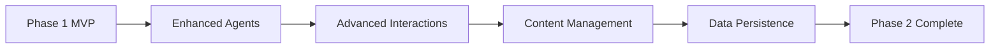

# 🚀 Implementation & MVP Roadmap

> A comprehensive development plan for building the Lessonly platform

---

## 📋 Overview

This roadmap outlines the phased development approach for Lessonly, from initial MVP to full-featured platform. Each phase builds upon the previous one, ensuring steady progress toward a complete educational technology solution.

---

## 🎯 Phase 1: MVP (Proof of Concept)

### 📊 Status & Timeline
| Status | Timeline | Priority |
|--------|----------|----------|
| 🟡 **In Progress** | 4-6 weeks | 🔴 High |

### 🎨 Core Features

#### **Basic UI in Streamlit**
- ✅ Clean, intuitive interface design
- ✅ Responsive layout for different screen sizes
- ✅ User-friendly navigation and controls
- ✅ Real-time interaction capabilities

#### **Minimal Viable Multi-Agent Setup**
- 🤖 **Orchestrator Agent**: Central coordination and workflow management
- 🤖 **Specialized Agents**: 1-2 focused agents for specific tasks
- 🔗 **Agent Communication**: Basic inter-agent messaging and coordination

#### **Lesson Generation System**
- 📚 **Predefined Categories**: Structured lesson templates
- 🎯 **Basic Interaction**: Simple user input and output handling
- 🔄 **Core Content Generation**: Automated lesson plan creation

### 🛠️ Technical Deliverables
```yaml
Phase 1 Components:
  Frontend:
    - Streamlit application
    - Basic form inputs
    - PDF export functionality
  
  Backend:
    - Multi-agent orchestration
    - Lesson generation engine
    - Basic error handling
  
  Output:
    - Structured lesson plans
    - PDF document export
    - User feedback collection
```

---

## 🚀 Phase 2: Enhanced Capabilities

### 📊 Status & Timeline
| Status | Timeline | Priority |
|--------|----------|----------|
| ⚪ **Planned** | 8-10 weeks | 🟡 Medium |

### 🔧 Expanded Architecture

#### **Complete Multi-Agent Setup**
- 🤖 **All Suggested Agents**: Full implementation of the agent ecosystem
- 🔄 **Advanced Coordination**: Sophisticated agent communication patterns
- 🛡️ **Robust Error Handling**: Comprehensive error management and recovery

#### **Advanced Interaction Patterns**
- 💬 **Complex Conversations**: Multi-turn dialog capabilities
- 🧠 **Context Awareness**: Memory and context preservation
- 🎯 **Dynamic Adaptation**: Real-time content personalization

#### **Content Management System**
- 🔄 **Regeneration Engine**: Advanced content modification capabilities
- 📊 **A/B Testing**: Performance optimization through testing
- 📝 **Version Control**: Lesson history and iteration tracking

#### **Data Persistence Layer**
- 💾 **Save Functionality**: Lesson storage and retrieval
- 📤 **Export Options**: Multiple format support (PDF, DOCX, etc.)
- ☁️ **Cloud Synchronization**: Cross-device access and backup

### 🎯 Key Improvements


---

## 🌟 Phase 3: Advanced Features

### 📊 Status & Timeline
| Status | Timeline | Priority |
|--------|----------|----------|
| ⚪ **Future** | 12-16 weeks | 🟢 Low |

### 👤 User Management System

#### **Authentication & Authorization**
- 🔐 **Secure Login System**: Multi-factor authentication support
- 👥 **Role-Based Access**: Teacher, student, and admin roles
- 📋 **User Profiles**: Personalized settings and preferences

#### **Personalized Libraries**
- 📚 **Custom Content**: User-generated lesson materials
- 🤝 **Collaborative Features**: Sharing and collaboration tools
- 🏷️ **Content Organization**: Advanced tagging and categorization

### 📊 Analytics & Insights

#### **Enhanced Analytics Dashboard**
- 📈 **User Interaction Monitoring**: Detailed usage analytics
- 📊 **Lesson Efficacy Metrics**: Learning outcome tracking
- 🎯 **Performance Analytics**: System performance monitoring
- 📋 **Learning Outcome Tracking**: Student progress assessment

### 🔗 External Integrations

#### **LMS Platform Connections**
| Platform | Integration Level | Features |
|----------|------------------|----------|
| 🏫 **Google Classroom** | Full Integration | Assignment sync, grade export |
| 🎓 **Canvas** | API Integration | Course management, content sync |
| 📚 **Moodle** | Plugin Support | Module integration, user sync |
| 🔌 **Custom APIs** | Flexible | Third-party platform support |

---

## 📊 Success Metrics & KPIs

### 🎯 Phase-Specific Targets

| Phase | Key Metrics | Target | Measurement Method |
|-------|-------------|--------|-------------------|
| **Phase 1** | Lesson Generation Success | 90% success rate | Automated testing |
| **Phase 1** | User Interface Usability | 85% satisfaction | User feedback |
| **Phase 2** | User Engagement | 70% retention rate | Analytics tracking |
| **Phase 2** | System Performance | < 2s response time | Performance monitoring |
| **Phase 3** | Platform Adoption | 1000+ active users | User registration |
| **Phase 3** | Integration Success | 95% uptime | System monitoring |

### 📈 Overall Success Criteria
- ✅ **Technical Excellence**: Robust, scalable architecture
- ✅ **User Satisfaction**: High usability and engagement scores
- ✅ **Business Growth**: Measurable platform adoption
- ✅ **Educational Impact**: Positive learning outcomes

---

## 🔄 Development Iteration Cycle


### 🎯 Each Phase Includes

#### **Development Phase**
- ✅ Feature implementation
- ✅ Code review and quality assurance
- ✅ Documentation updates

#### **Testing Phase**
- 🧪 Comprehensive testing (unit, integration, user)
- 🐛 Bug identification and resolution
- 📊 Performance benchmarking

#### **Feedback Phase**
- 📝 User feedback collection
- 🔍 Stakeholder review
- 📊 Data analysis and insights

#### **Refinement Phase**
- 🔧 Iterative improvements
- 📈 Performance optimization
- 🎯 Feature enhancement

---

## 📅 Timeline Overview

| Phase | Duration | Key Milestones | Deliverables |
|-------|----------|----------------|--------------|
| **Phase 1** | 4-6 weeks | MVP completion | Basic lesson generation |
| **Phase 2** | 8-10 weeks | Enhanced features | Advanced interactions |
| **Phase 3** | 12-16 weeks | Full platform | Complete ecosystem |

---
